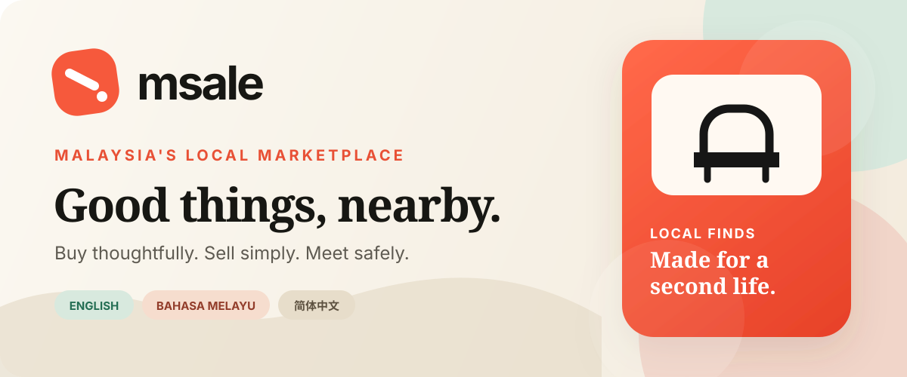
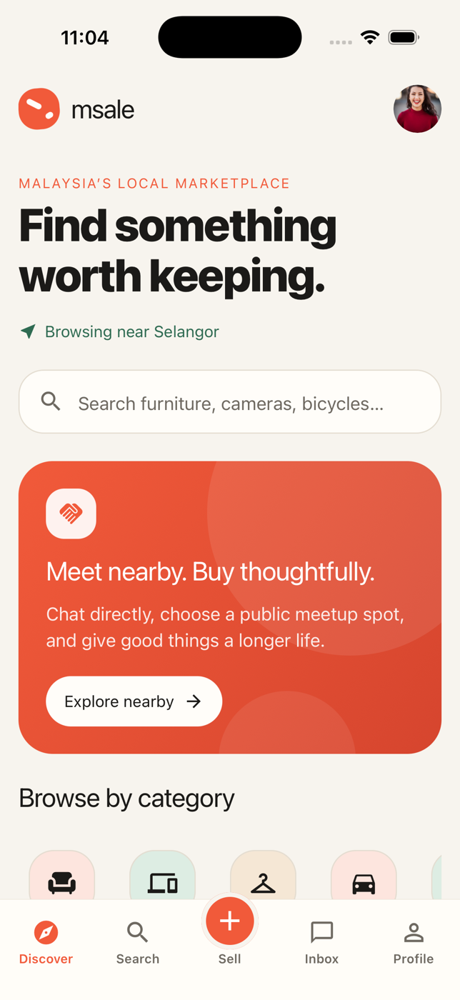
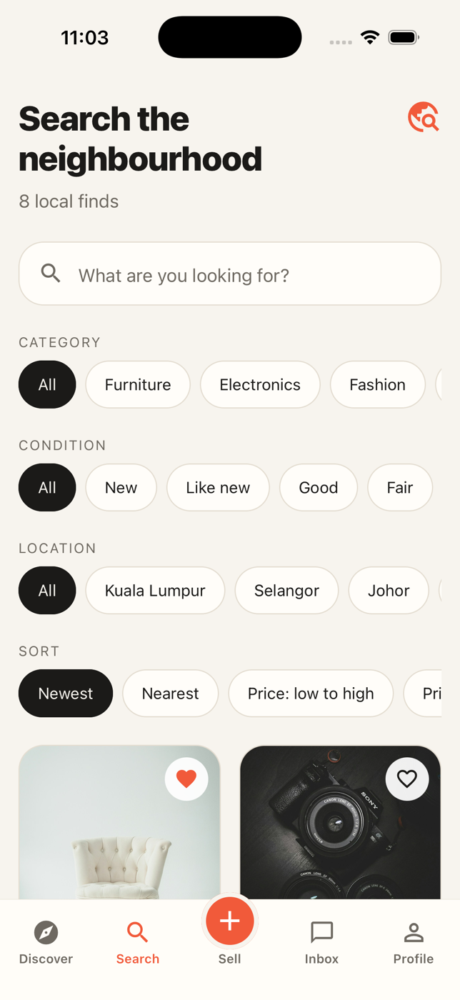
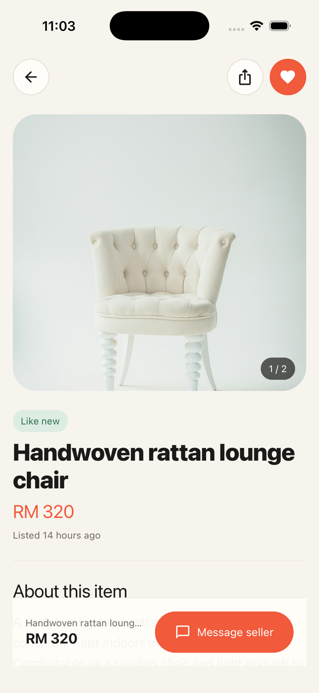
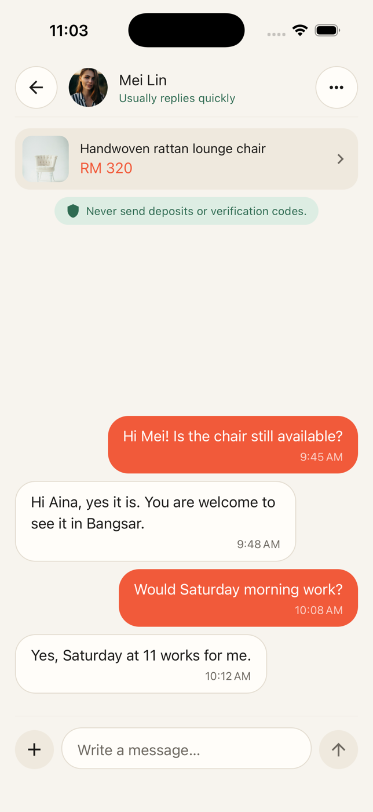

<p align="center">
  
</p>

<p align="center">
  <a href="https://github.com/sambalbalado/msale/actions/workflows/check.yml"></a>
  <a href="LICENSE"></a>
  
  
</p>

<p align="center">
  A warm, local-first peer-to-peer marketplace for Malaysia.<br />
  Discover pre-loved goods, list what you no longer need, and arrange safe meetups over chat.
</p>

<p align="center">
  <strong>English</strong> · <strong>Bahasa Melayu</strong> · <strong>简体中文</strong>
</p>

## A marketplace made for nearby

msale brings the familiar ease of a neighbourhood marketplace into a focused mobile experience. It is designed around thoughtful reuse, direct conversation, and public-place meetups—without payments, deposits, shipping, or platform fees.

The project includes a fully interactive demo repository for instant local development and a Supabase implementation for authentication, listings, image storage, profiles, favorites, and realtime-ready conversations.

> [!NOTE]
> msale is under active development. The core marketplace experience is functional, but moderation operations, production notification credentials, store review, and release QA remain before a public production launch.

## Product tour

<table>
  <tr>
    <td align="center"><strong>Discover</strong></td>
    <td align="center"><strong>Search</strong></td>
    <td align="center"><strong>Listings</strong></td>
    <td align="center"><strong>Chat</strong></td>
  </tr>
  <tr>
    <td></td>
    <td></td>
    <td></td>
    <td></td>
  </tr>
</table>

## What works today

| Area | Included |
| --- | --- |
| Discover | Responsive feed, category rail, nearby context, featured marketplace story |
| Search | Keyword search, category, condition, Malaysian state, and price sorting filters |
| Listings | Image gallery, condition, seller profile, location guidance, favorites, sharing |
| Sell | Guided creation flow, multi-image picker, validation, price and meetup details |
| Chat | Inbox, item context, safety prompts, optimistic messages, realtime-ready repository |
| Accounts | Email/password authentication, profile state, ratings, saved items |
| Localization | English, Bahasa Melayu, and Simplified Chinese with device-language detection |
| Backend | Supabase Auth, PostgreSQL, Storage, Realtime, indexes, triggers, and Row Level Security |
| Demo | Complete in-memory experience when no environment variables are configured |
| Design | Warm editorial visual system, dark mode, responsive layouts, haptics, and motion |

## Built with

- [Expo SDK 57](https://expo.dev/) and React Native 0.86
- [Expo Router](https://docs.expo.dev/router/introduction/) for typed, file-based navigation
- TypeScript 6 in strict mode
- [Supabase](https://supabase.com/) for Auth, PostgreSQL, Storage, and Realtime
- TanStack Query for server state and optimistic updates
- React Hook Form and Zod for validated listing forms
- FlashList and Expo Image for efficient marketplace feeds
- Reanimated and native haptics for interaction polish

## Quick start

### Requirements

- Node.js 22 or another version accepted by `package.json`
- npm
- Xcode and CocoaPods for iOS development
- Android Studio for Android development

`nvm` is optional. If Node is not installed, use the installer from [nodejs.org](https://nodejs.org/) or Homebrew:

```bash
brew install node
```

### Install and run

```bash
git clone https://github.com/sambalbalado/msale.git
cd msale
npm install
npm start
```

The app opens in demo mode without any accounts, services, or environment variables. From the Expo terminal, press `w` for web. Native development uses the commands below.

| Command | Purpose |
| --- | --- |
| `npm start` | Start the Expo development server |
| `npm run web` | Run the web app |
| `npm run ios` | Build and run the native iOS project |
| `npm run android` | Build and run the native Android project |
| `npm run check` | Run ESLint and TypeScript checks |
| `npm run doctor` | Check Expo dependency and configuration health |
| `npm run export:web` | Produce a static web export |

## iOS development

### Simulator

Build the native app once:

```bash
npx expo run:ios
```

For later sessions, start Metro and press `i`:

```bash
npx expo start --dev-client
```

If CocoaPods is unavailable, install it with `brew install cocoapods`. If Xcode reports a missing Simulator platform, install the matching runtime from **Xcode → Settings → Components**.

### Physical iPhone

The App Store version of Expo Go cannot open this Expo SDK 57 project. Use the included native development project instead:

1. Connect and trust the iPhone. Initial pairing normally requires a data-capable cable.
2. Enable **Settings → Privacy & Security → Developer Mode** on the iPhone.
3. Open `ios/msale.xcworkspace` in Xcode.
4. Select the **msale** target and choose an Apple account under **Signing & Capabilities → Team**.
5. Keep **Automatically manage signing** enabled.
6. Run `npx expo run:ios --device` and select the physical device.

A free Personal Team works for local development. Push Notifications are intentionally excluded from this local native target because Apple does not provision that capability for free Personal Teams. Production push credentials require an eligible Apple Developer membership.

<details>
<summary><strong>Common iPhone startup fixes</strong></summary>

#### `Unknown command: expo`

Use `npx expo`, not `npm expo`:

```bash
npx expo start --dev-client
```

If needed, reinstall dependencies and use the local binary:

```bash
npm install
./node_modules/.bin/expo start --dev-client
```

#### `No script URL provided` or development server unavailable

Start Metro, leave the terminal open, and reload the app:

```bash
npx expo start --dev-client --clear
```

The Mac and iPhone must be on the same local network unless the device is connected over USB.

#### The iPhone stays on “Opening project”

Do not use Expo Go for this SDK 57 project. Install the development build using `npx expo run:ios --device`.

#### The developer cannot be verified

On the iPhone, open **Settings → General → VPN & Device Management**, select the development identity, and trust it.

</details>

## Connect Supabase

Demo mode is selected automatically when the two public Supabase variables are absent.

1. Create a Supabase project in a region appropriate for Malaysian users.
2. Copy the environment template:

   ```bash
   cp .env.example .env
   ```

3. Add the project URL and publishable key from **Supabase → Project Settings → API**.
4. Apply `supabase/migrations/202609100001_initial_marketplace.sql` using the SQL editor or Supabase CLI:

   ```bash
   npx supabase login
   npx supabase link --project-ref YOUR_PROJECT_REF
   npx supabase db push
   ```

5. Add `msale://**` and your web URLs under **Authentication → URL Configuration**.
6. Restart Metro after changing environment variables.

Only the publishable client key belongs in the app. Never expose a Supabase service-role key. Database access is enforced by the migration's Row Level Security policies.

## Architecture

```text
Expo Router screens
        │
        ▼
TanStack Query hooks + Auth provider
        │
        ▼
MarketplaceRepository interface
        │
        ├── In-memory demo repository
        └── Supabase repository
              ├── Auth
              ├── PostgreSQL + RLS
              ├── Storage
              └── Realtime conversations
```

```text
app/                    Screens and navigation
components/             Design-system and marketplace components
constants/              Color, spacing, radius, shadow, and type tokens
data/                   Local demo fixtures
hooks/                  Query and presentation hooks
lib/                    Localization, formatting, and Supabase setup
providers/              Authentication state
services/               Demo and Supabase repository implementations
supabase/migrations/     Database and security source of truth
types/                  Domain models
```

The screens depend on the `MarketplaceRepository` interface rather than backend-specific logic. This keeps demo mode useful, makes the UI testable, and allows the production data source to evolve independently.

## Safety by design

- Approximate meetup areas are public; precise coordinates are not displayed.
- The interface encourages busy public meetup locations and daylight exchanges.
- Buyers are reminded to inspect items before paying.
- The product warns users never to send deposits or verification codes.
- Reporting and blocking are represented in the schema and remain on the pre-launch moderation roadmap.

Please report security issues according to [SECURITY.md](SECURITY.md), not through a public issue.

## Contributing

Contributions, bug reports, and design feedback are welcome. Read [CONTRIBUTING.md](CONTRIBUTING.md) before opening a pull request, and see [ROADMAP.md](ROADMAP.md) for the current release priorities.

## License

msale is available under the [MIT License](LICENSE).
